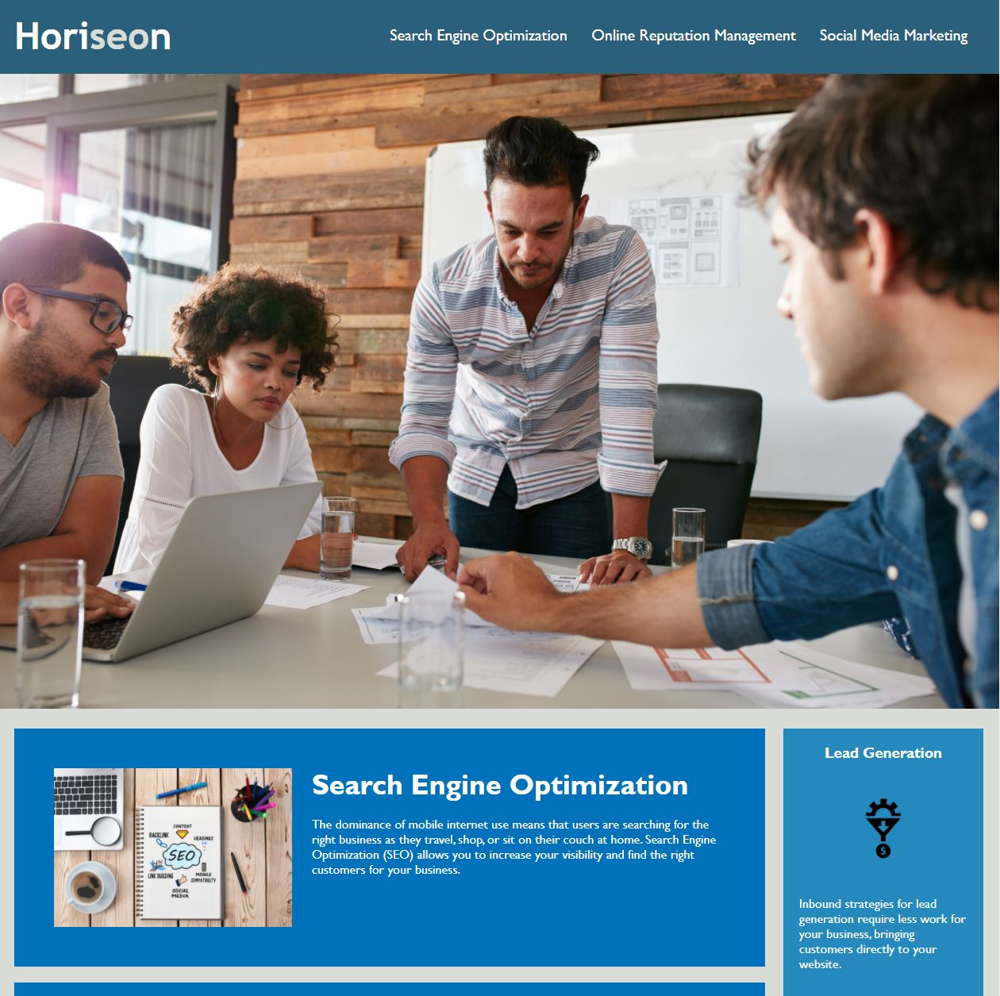
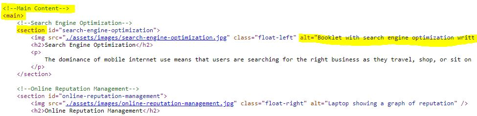

# Horiseon Accessibility and Refactor Project

## Description
Horiseon Social Solution Services, Inc, a ficticious company, was in need of a developer to update their site to the latest HTML5 standards and to address accessibility concerns. The following items represent the work completed during this project:
<ul>
	<li>Semantic HTML and logical element structuring</li>
	<li>Consolidation and clean up of CSS</li>
	<li>Addition of quality commenting for readability</li>
	<li>Use of alt attributes for images</li>
    <li>More descriptive title</li>
    <li>Minor updates to broken links</li>
</ul>

This project was a great oppurtunity to put into practice some of the latest HTML5 standards and to learn more about accessibility and how web pages should be structured for those with disabilities. 

## Usage
Visit the live site at the following URL: 
<a href="https://jonmooney.github.io/horiseon-accessibility/" target="_blank">https://jonmooney.github.io/horiseon-accessibility/</a> 
CTRL+Click or CMD+Click to open in a new window

Right click on the web page and select 'View Page Source' 
Look for logical commenting for different sections 
View the alt attribute values on the 3 images in the main section. This is what will show up when the image link is broken or when using a screen reader, etc. 
Look for Semantic HTML elements such as the following: 
`<header>` 
`<footer>` 
`<main>` 
`<nav>` 
`<section>` 
For a complete list, see the <a href="https://www.w3schools.com/html/html5_semantic_elements.asp">Semantic HTML elements</a> page on W3 Schools.

### Screenshot: Overall look

### Screenshot: Example of comments, semantic elements, and alt attribute

## Features
HTML 
CSS 
Git/GitHub

## Credits
Project material provided by UC Davis Coding Bootcamp

## License
The last section of a high-quality README file is the license. This lets other developers know what they can and cannot do with your project. If you need help choosing a license, refer to [https://choosealicense.com/](https://choosealicense.com/).